# Task 1: Essential Kubernetes Troubleshooting Commands

## 1. Check Pod Status (`kubectl get`)

First, apply the Pod and check its status. `-o wide` gives some extra information like the Pod IP and the Node where it is running.

```bash
kubectl apply -f pod.yaml
kubectl get pods
kubectl get pods -o wide
kubectl delete -f pod.yaml
```


## 2. Get Pod Details (`kubectl describe`)

`kubectl describe` gives more details about the Pod, including its events and any issues that might be stopping it from running properly.

```bash
cd 02-kubectl-describe
kubectl apply -f demo-pod.yaml
kubectl describe pod describe-demo
kubectl delete -f demo-pod.yaml
```


## 3. Check Application Logs (`kubectl logs`)

Use `kubectl logs` to see what the application inside the Pod is printing. This is useful when the application is crashing or not behaving as expected.

```bash
cd 03-kubectl-logs
kubectl apply -f pod.yaml
kubectl logs logs-demo
kubectl delete -f pod.yaml
```


## 4. Run Commands Inside a Pod (`kubectl exec`)

`kubectl exec` lets us run commands directly inside a running container. Here, we check the hostname and the files inside the Nginx web directory.

```bash
cd 04-kubectl-exec
kubectl apply -f pod.yaml
kubectl exec -it exec-demo -- bash -c "hostname && ls /usr/share/nginx/html"
kubectl delete -f pod.yaml
```


## 5. Check Events & Resource Usage

These commands help us check what is happening in the cluster and see the resource usage of the Pods.

```bash
cd 05-events
kubectl apply -f pod.yaml
kubectl get events --sort-by=.lastTimestamp
kubectl top pods
kubectl explain pod.spec.containers
kubectl delete -f pod.yaml
```


---

# Task 2: Troubleshooting Common Kubernetes Issues

## 1. Troubleshooting `CrashLoopBackOff`

- **Problem:** The container repeatedly starts, fails, and restarts, eventually entering a `CrashLoopBackOff` state.
- **Investigation:**
  1. Checked the Pod status with `kubectl get pod crash-demo`.
  2. Inspected container state and exit code using `kubectl describe pod crash-demo`.
  3. Checked application error logs using `kubectl logs crash-demo`.
- **Root Cause:** The container command executed `exit 1`, causing the process to terminate with an error code immediately after launch.
- **Fix:** Updated the command in `fixed-pod.yaml` to execute a long-running process (`sleep 3600`) and keep the application alive.

```powershell
kubectl apply -f 06-crashloopbackoff/broken-pod.yaml
kubectl get pod crash-demo
```


```powershell
kubectl describe pod crash-demo
```
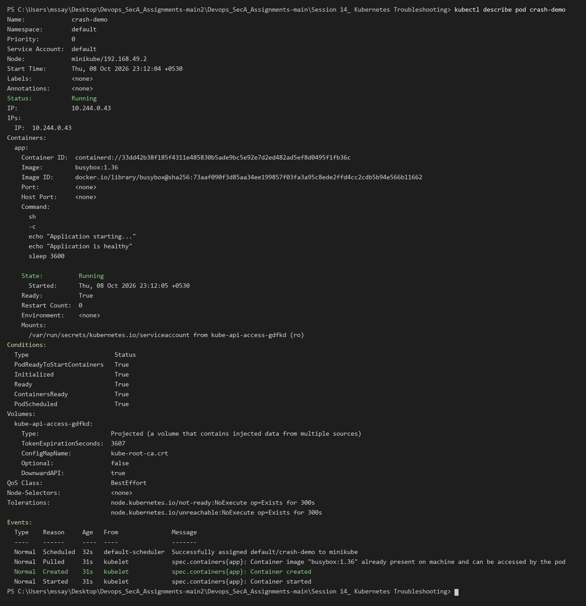

```powershell
kubectl logs crash-demo
```
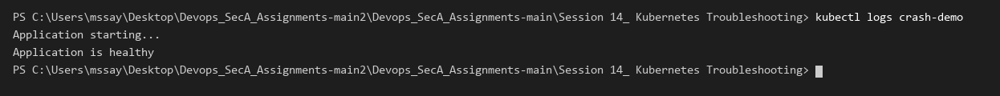

```powershell
kubectl delete pod crash-demo
kubectl apply -f 06-crashloopbackoff/fixed-pod.yaml
kubectl get pod crash-demo
```
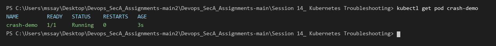


---

## 2. Troubleshooting `ImagePullBackOff` & `ErrImagePull`

- **Problem:** Kubernetes is unable to download the container image, leaving the Pod in `ErrImagePull` and `ImagePullBackOff` status.
- **Investigation:**
  1. Checked Pod status with `kubectl get pod image-demo`.
  2. Inspected the Pod events with `kubectl describe pod image-demo`.
- **Root Cause:** The Pod manifest referenced a non-existent image tag `nginx:this-image-does-not-exist`.
- **Fix:** Corrected the image specification in `fixed-pod.yaml` to a valid image tag `nginx:1.27`.

```powershell
kubectl apply -f 07-imagepullbackoff/broken-pod.yaml
kubectl get pod image-demo
```
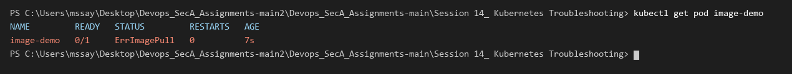

```powershell
kubectl describe pod image-demo
```
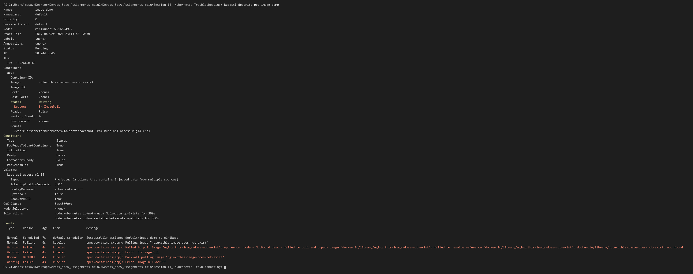

```powershell
kubectl delete pod image-demo
kubectl apply -f 07-imagepullbackoff/fixed-pod.yaml
kubectl get pod image-demo
```
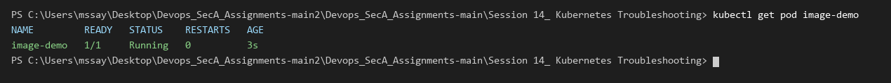


---

## 3. Troubleshooting `Pending` Pods

- **Problem:** The Pod remains stuck in `Pending` status and is never scheduled onto a worker node.
- **Investigation:**
  1. Checked Pod status with `kubectl get pod pending-demo`.
  2. Inspected scheduling events with `kubectl describe pod pending-demo`.
  3. Checked available cluster nodes with `kubectl get nodes`.
- **Root Cause:** The Pod specified an invalid `nodeSelector` (`kubernetes.io/hostname: node-that-does-not-exist`), which didn't match any node in the cluster.
- **Fix:** Removed the invalid `nodeSelector` constraint in `fixed-pod.yaml`.

```powershell
kubectl apply -f 08-pending-pods/broken-pod.yaml
kubectl get pod pending-demo
```
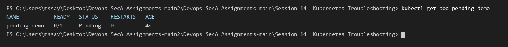

```powershell
kubectl describe pod pending-demo
```
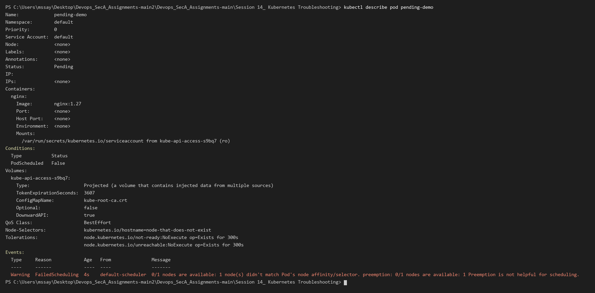

```powershell
kubectl delete pod pending-demo
kubectl apply -f 08-pending-pods/fixed-pod.yaml
kubectl get pod pending-demo
```
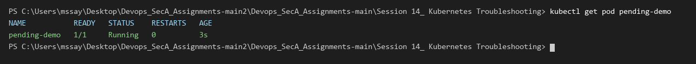


---

## 4. Service Connectivity & DNS Troubleshooting

- **Problem:** Traffic sent to the Service fails to route to application Pods because the Service has `<none>` endpoints.
- **Investigation:**
  1. Deployed the application and checked endpoints with `kubectl get endpoints broken-service`.
  2. Compared the Service selector from `kubectl describe service broken-service` with the actual Pod labels from `kubectl get pods --show-labels`.
- **Root Cause:** Label selector mismatch (`app: does-not-exist` in Service vs `app: web` on Pods).
- **Fix & Verification:**
  1. Updated the Service selector to `app: web`.
  2. Verified that endpoints were populated with active Pod IP addresses.
  3. Tested internal DNS resolution using `nslookup web-service.default.svc.cluster.local` from a test Pod.
  4. Verified end-to-end HTTP response using `wget -qO- http://web-service`.

```powershell
kubectl get endpoints broken-service
```
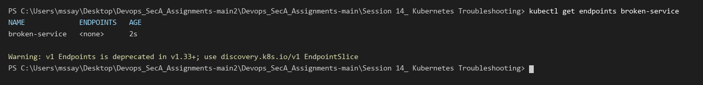

```powershell
kubectl describe service broken-service
```
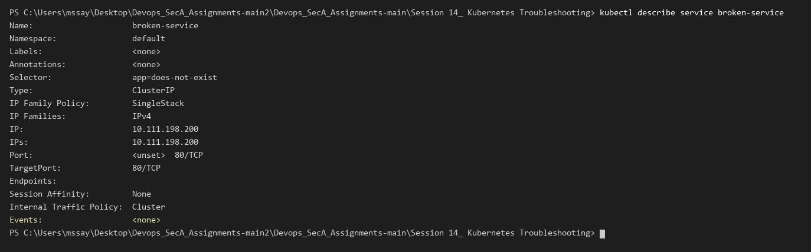

```powershell
kubectl get endpoints web-service
```
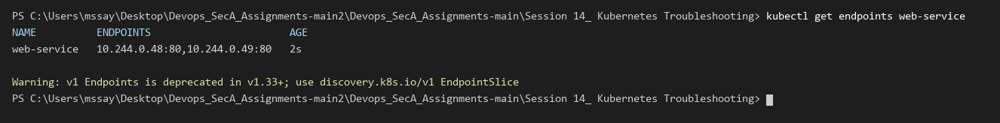

```powershell
kubectl exec dns-test -- nslookup web-service.default.svc.cluster.local
```
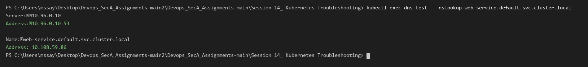

```powershell
kubectl exec dns-test -- wget -qO- http://web-service
```
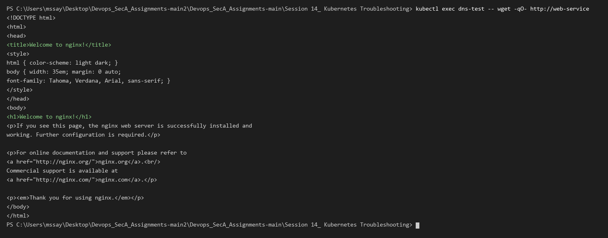


---

# Task 3: Kubernetes Troubleshooting Mini Project

## 1. Project Overview & Baseline Deployment

In this mini-project, I deployed an Nginx workload managed by a Deployment and exposed through a ClusterIP Service. Then I systematically triaged intentional workload and service failures.

```powershell
kubectl apply -f mini-project/deployment.yaml
kubectl apply -f mini-project/service.yaml
kubectl get pods -o wide
```
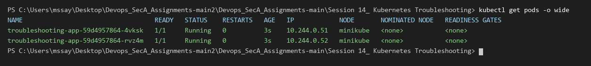

```powershell
kubectl get endpoints troubleshooting-service
```
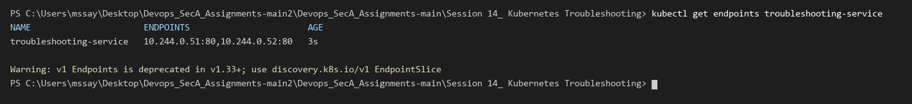

---

## 2. Scenario 1: Broken Pod Triage

- **Problem Statement:** Deployed `project-broken-pod` and observed that the container failed to initialize.
- **Investigation:**
  - `kubectl get pod project-broken-pod` showed `ErrImagePull`.
  - `kubectl describe pod project-broken-pod` revealed `Failed to pull image "nginx:this-tag-does-not-exist"`.
- **Root Cause:** An invalid image tag was configured in `broken-pod.yaml`.
- **Solution:** Corrected the image tag to `nginx:1.27`.

```powershell
kubectl get pod project-broken-pod
```
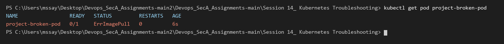

```powershell
kubectl describe pod project-broken-pod
```
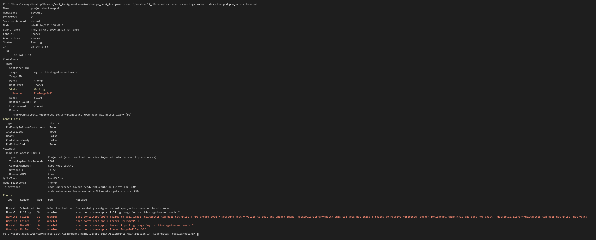

---

## 3. Scenario 2: Service Selector Mismatch Triage

- **Problem Statement:** The Service stopped forwarding traffic to backend Pods, resulting in broken application routing.
- **Investigation:**
  - `kubectl get endpoints troubleshooting-service` showed `<none>`.
  - `kubectl describe service troubleshooting-service` showed `Selector: app=wrong-app`.
  - `kubectl get pods --show-labels` showed Pods were labeled `app=troubleshooting-app`.
- **Root Cause:** Service selector `app=wrong-app` did not match the Pod labels.
- **Solution:** Restored `selector: app: troubleshooting-app` in `service.yaml`.

```powershell
kubectl get endpoints troubleshooting-service
```
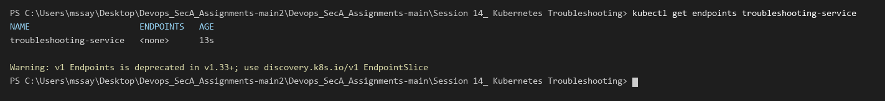

```powershell
kubectl describe service troubleshooting-service
```
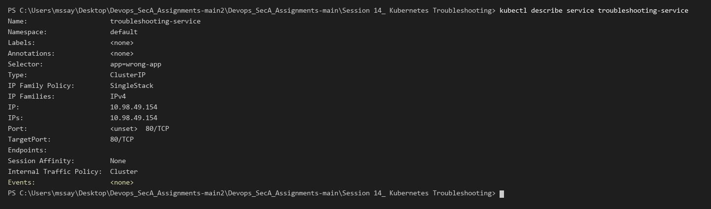

```powershell
kubectl apply -f mini-project/service.yaml
kubectl get endpoints troubleshooting-service
```
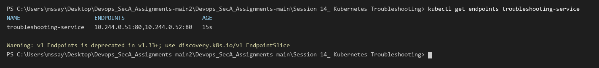

---

## 4. Troubleshooting Summary Table

| Problem | Symptoms Observed | Diagnostic Command | Root Cause | Resolution |
| :--- | :--- | :--- | :--- | :--- |
| **CrashLoopBackOff** | Container restarts repeatedly, 0/1 READY | `kubectl describe pod`, `kubectl logs` | Exit code 1 due to crashing process | Replace failing command with long-running process |
| **ImagePullBackOff** | Pod status `ErrImagePull` / `ImagePullBackOff` | `kubectl describe pod` (Events) | Non-existent image tag | Update image tag to valid version |
| **Pending Pod** | Pod stuck in `Pending`, not scheduled | `kubectl describe pod` | `nodeSelector` mismatch with cluster nodes | Fix or remove invalid nodeSelector |
| **Service Selector Mismatch** | Service has `<none>` endpoints | `kubectl describe service`, `kubectl get endpoints` | Selector does not match Pod labels | Update Service selector to match Pod labels |
| **DNS / Service Routing** | Connection refused / resolution failure | `kubectl exec -- nslookup`, `wget` | Wrong DNS hostname or missing endpoints | Verify CoreDNS, resolve FQDN, verify endpoints |

