# Session 15: Helm

## Task 1: Essential Helm Commands

### 1. Create a Helm Chart (`helm create`)
Used `helm create` to generate the default directory structure and template files for a new chart.

```powershell
helm create mychart
```
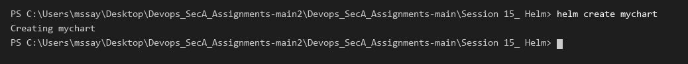

---

### 2. Install a Chart Release (`helm install`)
Installed the chart as a named release (`demo-release`) into the local Kubernetes cluster.

```powershell
helm install demo-release ./01-helm-commands/mychart
```
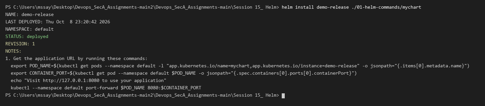

---

### 3. List Releases (`helm list`)
Checked the list of deployed Helm releases and verified the revision and status.

```powershell
helm list
```
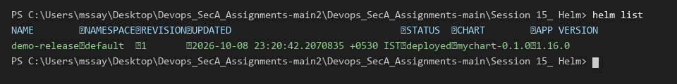

---

### 4. Check Release Status (`helm status`)
Viewed the detailed status of the deployed release, including namespace, status, revision, and notes.

```powershell
helm status demo-release
```
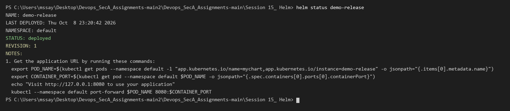

---

### 5. Inspect Values and Manifests (`helm get`)
Retrieved the user-supplied values and rendered Kubernetes manifests for the release.

```powershell
helm get values demo-release
```
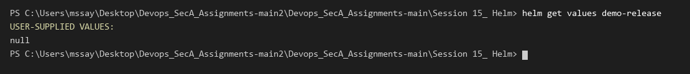

```powershell
helm get manifest demo-release | Select-Object -First 25
```
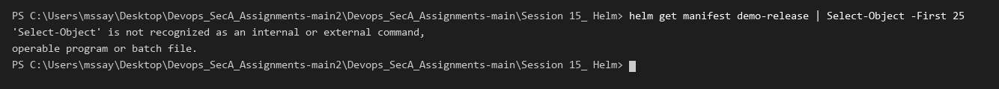

---

### 6. Upgrade a Release (`helm upgrade`)
Upgraded the release by overriding values at runtime using the `--set` flag.

```powershell
helm upgrade demo-release ./01-helm-commands/mychart --set replicaCount=2
```
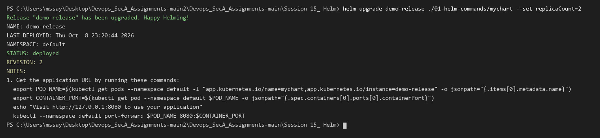

---

### 7. View Release History (`helm history`)
Inspected the revision history of the release to see past revisions, status, and descriptions.

```powershell
helm history demo-release
```
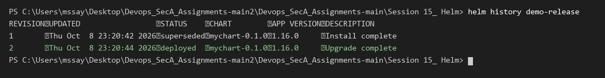

---

### 8. Rollback a Release (`helm rollback`)
Rolled back the release to the previous revision (`Revision 1`).

```powershell
helm rollback demo-release 1
```
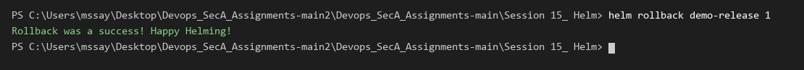

---

### 9. Uninstall a Release (`helm uninstall`)
Uninstalled the release and cleaned up all associated Kubernetes resources.

```powershell
helm uninstall demo-release
```
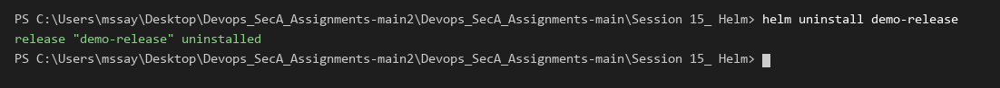

---

### 10. Repository Management & Search (`helm repo` & `helm search`)
Added the Bitnami chart repository, listed installed repositories, and searched for available charts.

```powershell
helm repo add bitnami https://charts.bitnami.com/bitnami
```
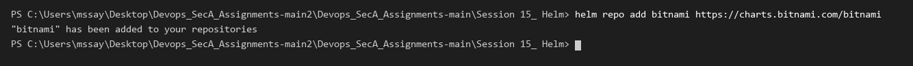

```powershell
helm repo list
```
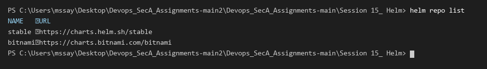

```powershell
helm search repo bitnami/nginx | Select-Object -First 10
```
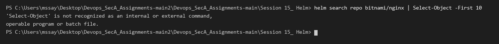


---

# Task 2: Helm Rollback Workflow

In this task, I performed a complete sequential lifecycle workflow: installing Revision 1, upgrading to Revision 2, upgrading to Revision 3, and rolling back to Revision 2.

### Step 1: Install Revision 1 (1 Replica)
Deployed the initial release configured with 1 pod replica.

```powershell
helm install rollback-demo ./02-helm-rollback/app-chart --set replicaCount=1
```
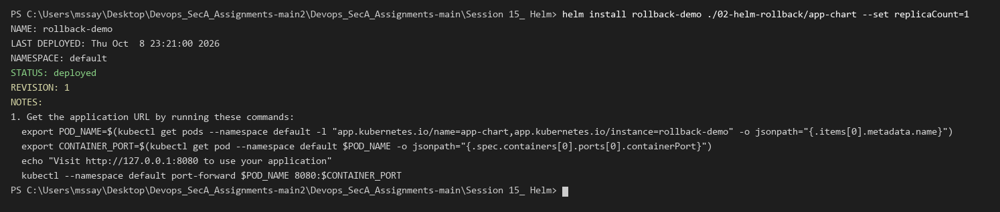

```powershell
kubectl get pods
```
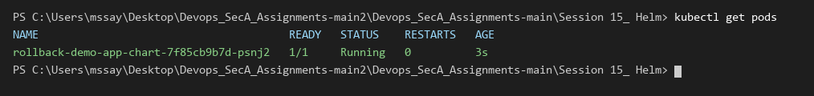

---

### Step 2: Upgrade to Revision 2 (2 Replicas)
Scaled the deployment to 2 replicas via `helm upgrade`.

```powershell
helm upgrade rollback-demo ./02-helm-rollback/app-chart --set replicaCount=2
```


```powershell
kubectl get pods
```


---

### Step 3: Upgrade to Revision 3 (3 Replicas)
Scaled the deployment to 3 replicas via another `helm upgrade`.

```powershell
helm upgrade rollback-demo ./02-helm-rollback/app-chart --set replicaCount=3
```


```powershell
kubectl get pods
```
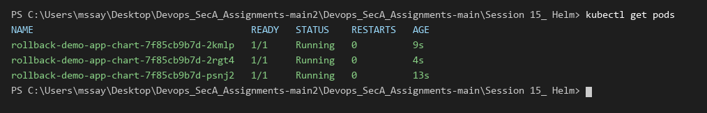

---

### Step 4: Check History Before Rollback
Checked the 3 active revisions recorded in Helm history.

```powershell
helm history rollback-demo
```
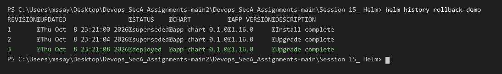

---

### Step 5: Rollback to Revision 2 & Verify
Rolled back the release to Revision 2 (2 replicas) and verified the running pods and history.

```powershell
helm rollback rollback-demo 2
```
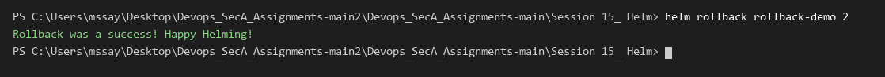

```powershell
kubectl get pods
```
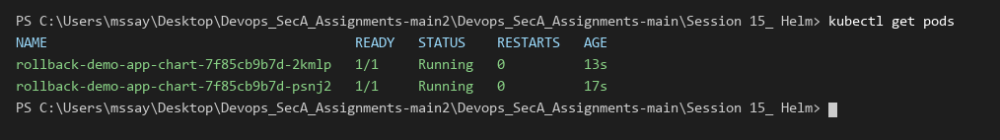

```powershell
helm history rollback-demo
```
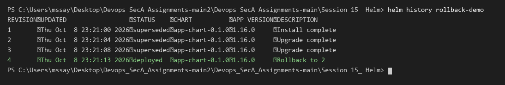


---

# Task 3: Helm Mini Project (Notes App Deployment)

## 1. Project Overview & Chart Structure

Created a custom Helm chart for a Notes Web Application with configurable environments (development vs production):

```text
notes-chart/
├── Chart.yaml
├── values.yaml
├── values-prod.yaml
└── templates/
    ├── configmap.yaml
    ├── deployment.yaml
    └── service.yaml
```

---

## 2. Chart Validation & Local Template Rendering

### Lint Chart
Validated chart syntax and best practices.

```powershell
helm lint ./mini-project/notes-chart
```
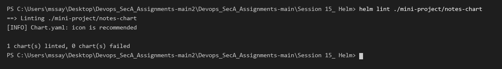

### Render Templates Locally
Tested template variable substitution locally before installing.

```powershell
helm template notes-dev ./mini-project/notes-chart | Select-Object -First 30
```
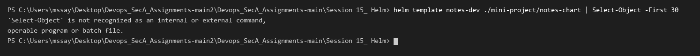

---

## 3. Development Deployment

Installed the application using development defaults (`values.yaml` - 1 replica, `nginx:1.24`).

```powershell
helm install notes-dev ./mini-project/notes-chart
```
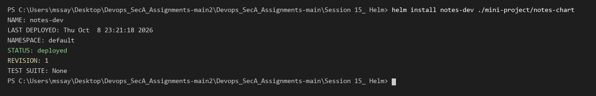

```powershell
kubectl get pods,svc,configmaps -l app=notes-dev
```
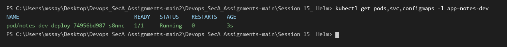

---

## 4. Production Upgrade

Upgraded the release using production values (`values-prod.yaml` - 3 replicas, `nginx:1.25`).

```powershell
helm upgrade notes-dev ./mini-project/notes-chart -f ./mini-project/notes-chart/values-prod.yaml
```
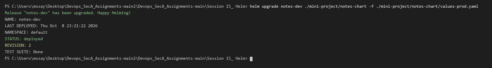

```powershell
kubectl get pods -l app=notes-dev
```
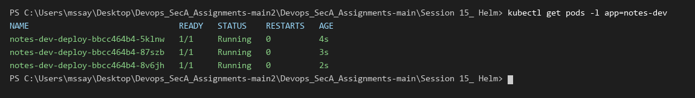

```powershell
helm history notes-dev
```
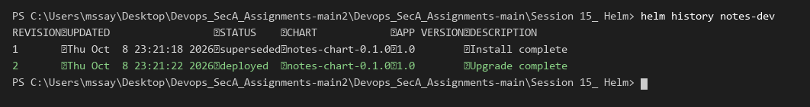

---

## 5. Simulating a Failed Upgrade & Rollback

### Step 1: Simulate Bad Upgrade
Upgraded the release with an invalid non-existent image tag.

```powershell
helm upgrade notes-dev ./mini-project/notes-chart --set image.tag=broken-tag-does-not-exist
```


```powershell
kubectl get pods -l app=notes-dev
```
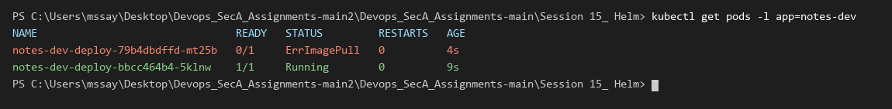

### Step 2: Rollback to Healthy Production Revision (Revision 2)
Recovered the release by rolling back to Revision 2.

```powershell
helm rollback notes-dev 2
```
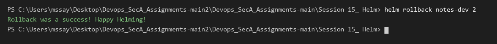

```powershell
kubectl get pods -l app=notes-dev
```


```powershell
helm history notes-dev
```
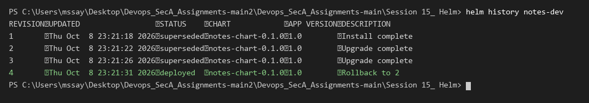
