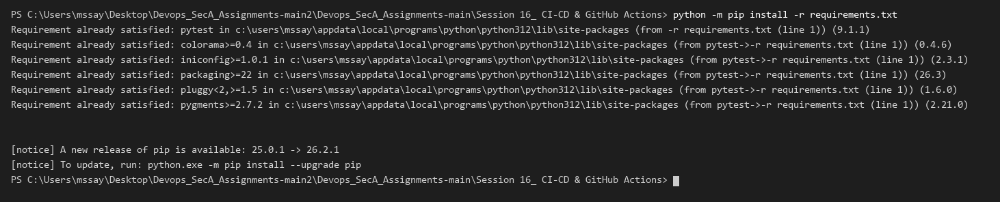
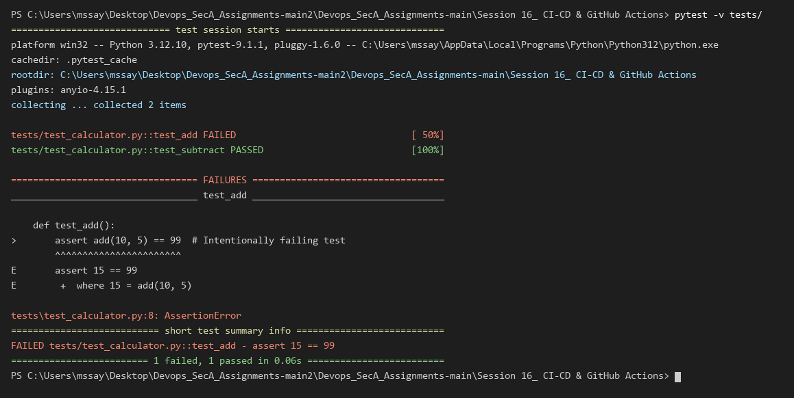
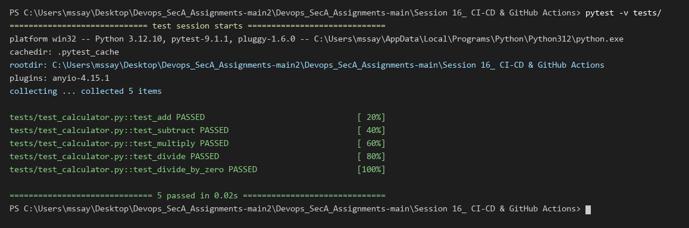
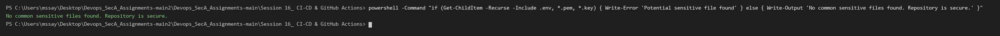
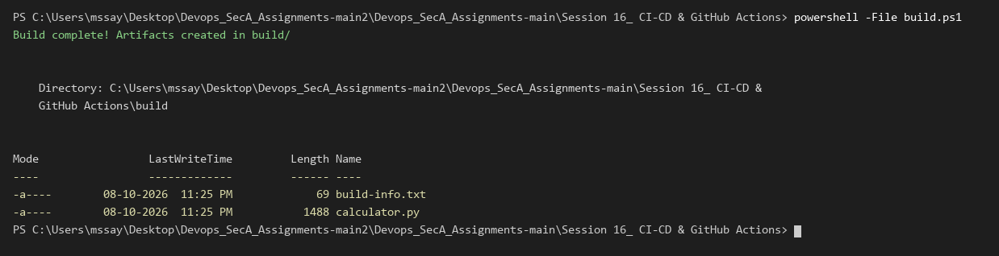
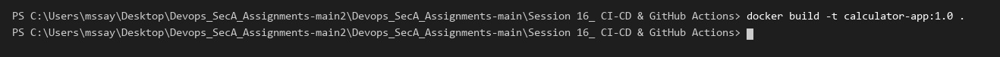
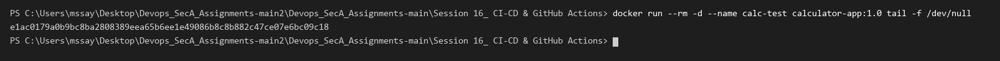
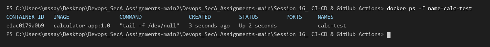
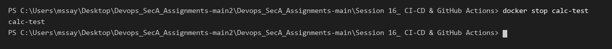

# Session 16: CI/CD & GitHub Actions

## 1. Overview & Architecture

In this project, I built an automated CI/CD pipeline using GitHub Actions for a Python Calculator Application.

### CI vs CD Concepts
- **Continuous Integration (CI):** Automatically builds, lints, and tests code changes on every commit or pull request to identify errors early.
- **Continuous Deployment (CD):** Automatically packages the tested application (into Docker containers or deployable artifacts) and releases it to production environments.

### Pipeline Flow
```text
Developer Push
      │
      ▼
┌──────────────┐
│  Test Suite  │  (pytest unit tests)
└──────┬───────┘
       │ PASS
       ▼
┌──────────────┐
│Security Scan │  (sensitive files & secrets check)
└──────┬───────┘
       │ PASS
       ▼
┌──────────────┐
│ Build Stage  │  (package artifact & build-info)
└──────┬───────┘
       │
       ▼
┌──────────────┐
│ CD Packaging │  (build & deploy Docker container)
└──────────────┘
```

---

## 2. Project Directory Layout

```text
Session 16_ CI-CD & GitHub Actions/
├── .github/
│   └── workflows/
│       ├── ci.yml
│       └── cd.yml
├── app/
│   ├── calculator.py
│   └── __init__.py
├── tests/
│   └── test_calculator.py
├── build/
│   ├── calculator.py
│   └── build-info.txt
├── Dockerfile
├── requirements.txt
├── build.sh
├── screenshots/
└── README.md
```

---

## 3. GitHub Actions Workflow Configurations

### CI Workflow (`.github/workflows/ci.yml`)
Runs automated unit testing, security checks, and artifact packaging on `push` and `pull_request` to `main`.

```yaml
name: CI Pipeline

on:
  push:
    branches: [ main ]
  pull_request:
    branches: [ main ]
  workflow_dispatch:

jobs:
  test:
    name: Run Unit Tests
    runs-on: ubuntu-latest
    steps:
      - uses: actions/checkout@v4
      - uses: actions/setup-python@v5
        with:
          python-version: "3.12"
      - run: pip install -r requirements.txt
      - run: pytest -v tests/

  security:
    name: Security & Secret Scan
    runs-on: ubuntu-latest
    steps:
      - uses: actions/checkout@v4
      - name: Scan for Sensitive Files
        run: |
          if find . -type f \( -name ".env" -o -name "*.pem" -o -name "*.key" \) | grep -q .; then
            exit 1
          fi

  build:
    name: Build & Package Artifact
    needs: [test, security]
    runs-on: ubuntu-latest
    steps:
      - uses: actions/checkout@v4
      - uses: actions/setup-python@v5
        with:
          python-version: "3.12"
      - run: |
          chmod +x build.sh
          ./build.sh
      - uses: actions/upload-artifact@v4
        with:
          name: calculator-build-artifact
          path: build/
```

### CD Workflow (`.github/workflows/cd.yml`)
Triggers upon successful CI completion to build the containerized application image.

```yaml
name: CD Pipeline

on:
  workflow_run:
    workflows: ["CI Pipeline"]
    types: [completed]
    branches: [main]
  workflow_dispatch:

jobs:
  deploy:
    name: Build & Deploy Container
    if: ${{ github.event.workflow_run.conclusion == 'success' || github.event_name == 'workflow_dispatch' }}
    runs-on: ubuntu-latest
    steps:
      - uses: actions/checkout@v4
      - uses: docker/setup-buildx-action@v3
      - name: Build Docker Image
        run: docker build -t calculator-app:${{ github.sha }} .
```

---

## 4. Pipeline Execution & Verification

### Step 1: Install Dependencies
Installed testing dependencies (`pytest`) specified in `requirements.txt`.

```powershell
python -m pip install -r requirements.txt
```


---

### Step 2: Execute Test Suite (All Passing)
Ran `pytest` to execute unit tests for addition, subtraction, multiplication, and division.

```powershell
pytest -v tests/
```


---

### Step 3: Test Failure Simulation & Triage
Simulated a failing test assertion in `test_add()`. The pipeline immediately catches the regression and fails the test job before build.

```powershell
pytest -v tests/
```


---

### Step 4: Fix Application & Retest
Restored the correct calculation logic and verified all 5 tests pass again.

```powershell
pytest -v tests/
```


---

### Step 5: Security & Secret Scan
Executed a security check ensuring no sensitive files (`.env`, `*.pem`, `*.key`) are exposed in the repository.

```powershell
powershell -Command "if (Get-ChildItem -Recurse -Include .env, *.pem, *.key) { Write-Error 'Potential sensitive file found' } else { Write-Output 'No common sensitive files found. Repository is secure.' }"
```


---

### Step 6: Application Build & Artifact Generation
Executed the build process to generate the release directory and `build-info.txt` metadata artifact.

```powershell
powershell -File build.ps1
```


---

### Step 7: Container Image Build (CD Packaging)
Built the production container image using Docker.

```powershell
docker build -t calculator-app:1.0 .
```


---

### Step 8: Container Run & Status Verification
Started the containerized application and verified its healthy running state.

```powershell
docker run --rm -d --name calc-test calculator-app:1.0 tail -f /dev/null
```


```powershell
docker ps -f name=calc-test
```


```powershell
docker stop calc-test
```


---

## 5. Summary of CI/CD Concepts Practiced

| Concept | Implementation in Project |
| :--- | :--- |
| **Workflow** | Defined in `.github/workflows/ci.yml` and `cd.yml` |
| **Jobs** | `test`, `security`, `build`, and `deploy` |
| **Steps** | Checkout, Python setup, pip install, pytest, build script, docker build |
| **Runners** | `ubuntu-latest` GitHub-hosted runners |
| **Secrets & Security** | Scanned repository against uncommitted sensitive keys/files |
| **Artifacts** | Uploaded `build/` folder using `actions/upload-artifact@v4` |
| **Gating** | Build job depends on `needs: [test, security]` |
