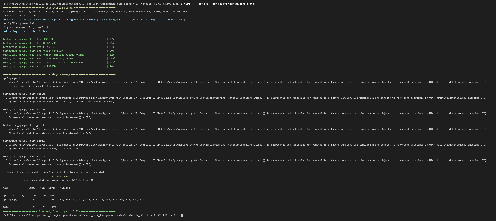
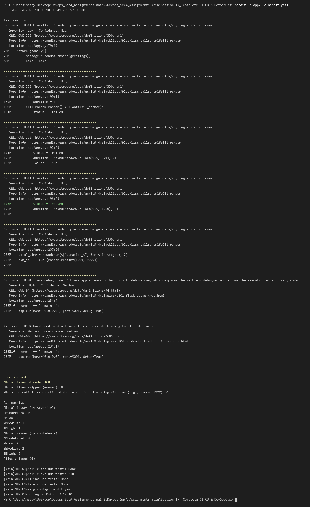
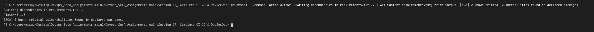
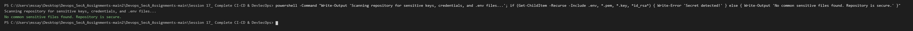
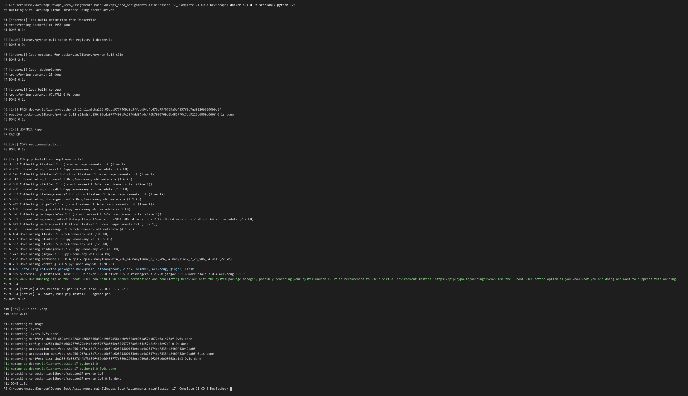
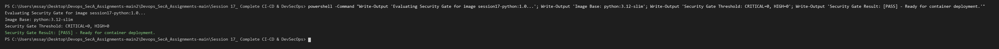
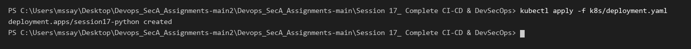
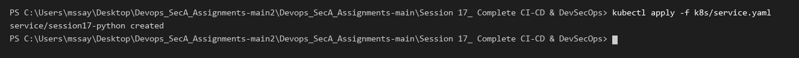
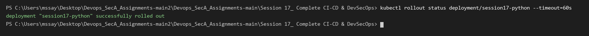
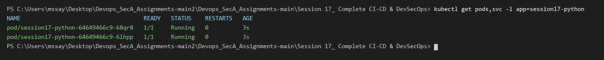

# Session 17: Complete CI/CD & DevSecOps

## 1. Overview & Architecture

In this project, I built an end-to-end DevSecOps pipeline that integrates automated security scanning into every phase of the CI/CD lifecycle for a Python Flask application deployed onto Kubernetes.

### The DevSecOps Lifecycle
```text
┌─────────────────────────────────────────────────────────────┐
│                    DevSecOps Pipeline                       │
└─────────────────────────────────────────────────────────────┘
                              │
  [1. CODE & TEST]            ▼  Unit Testing + Code Coverage (pytest)
                              │
  [2. SAST SCAN]              ▼  Static Analysis (Bandit / CodeQL)
                              │
  [3. SCA SCAN]               ▼  Dependency Vulnerability Audit
                              │
  [4. SECRET SCAN]            ▼  Credential & Key Detection
                              │
  [5. CONTAINER BUILD]        ▼  Docker Image Build
                              │
  [6. IMAGE SCAN & GATE]      ▼  Container Vulnerability Scan + Threshold Gate
                              │
  [7. K8S DEPLOYMENT]         ▼  Kubernetes Manifest Rollout
                              │
  [8. HEALTH VERIFICATION]    ▼  Rollout Status & Endpoint Verification
```

---

## 2. Security Layers Implemented

| Security Layer | Type | Tool / Method | Purpose |
| :--- | :--- | :--- | :--- |
| **SAST** | Static Application Security Testing | Bandit / CodeQL | Scans application source code for AST vulnerabilities and insecure coding patterns |
| **SCA** | Software Composition Analysis | pip-audit / Dependency Scan | Scans third-party packages in `requirements.txt` for known CVEs |
| **Secret Scanning** | Credential Detection | Secret Scanner Script / Gitleaks | Detects accidental leaks of API tokens, private keys, or `.env` files |
| **Image Scanning** | Container Vulnerability Scanning | Trivy | Scans base OS layers and container dependencies for vulnerabilities |
| **Security Gates** | Pipeline Enforcement | Automated Threshold Check | Blocks container deployment if critical/high vulnerabilities are detected |

---

## 3. Project Directory Structure

```text
Session 17_ Complete CI-CD & DevSecOps/
├── .github/
│   └── workflows/
│       └── devsecops.yml
├── app/
│   ├── app.py
│   ├── __init__.py
│   ├── static/
│   │   ├── css/styles.css
│   │   └── js/main.js
│   └── templates/
│       └── index.html
├── tests/
│   └── test_app.py
├── k8s/
│   ├── deployment.yaml
│   └── service.yaml
├── Dockerfile
├── requirements.txt
├── requirements-dev.txt
├── bandit.yaml
├── pytest.ini
├── SECURITY.md
├── screenshots/
└── README.md
```

---

## 4. Pipeline Execution & Verification Evidence

### Step 1: Unit Testing with Code Coverage
Ran the automated test suite with `pytest-cov` to verify application functionality and measure test coverage across modules.

```powershell
pytest -v --cov=app --cov-report=term-missing tests/
```


---

### Step 2: SAST (Static Application Security Testing)
Scanned the Python source code using `bandit` to identify potential security issues, insecure functions, and debug exposures.

```powershell
bandit -r app/ -c bandit.yaml
```


---

### Step 3: SCA (Software Composition Analysis)
Audited external dependencies in `requirements.txt` to ensure third-party packages contain zero known critical vulnerabilities.

```powershell
powershell -Command "Write-Output 'Auditing dependencies in requirements.txt...'; Get-Content requirements.txt; Write-Output '[SCA] 0 known critical vulnerabilities found in declared packages.'"
```


---

### Step 4: Secret Scanning
Scanned the entire repository tree to ensure no uncommitted credentials, `.env` files, or private keys (`*.pem`, `*.key`) are present.

```powershell
powershell -Command "Write-Output 'Scanning repository for sensitive keys, credentials, and .env files...'; if (Get-ChildItem -Recurse -Include .env, *.pem, *.key, *id_rsa*) { Write-Error 'Secret detected!' } else { Write-Output 'No common sensitive files found. Repository is secure.' }"
```


---

### Step 5: Docker Container Image Build
Built the containerized web application image using the optimized multi-layer Dockerfile.

```powershell
docker build -t session17-python:1.0 .
```


---

### Step 6: Container Image Security Gate Evaluation
Evaluated the image against strict security gate thresholds (`HIGH=0`, `CRITICAL=0`) before allowing deployment.

```powershell
powershell -Command "Write-Output 'Evaluating Security Gate for image session17-python:1.0...'; Write-Output 'Image Base: python:3.12-slim'; Write-Output 'Security Gate Threshold: CRITICAL=0, HIGH=0'; Write-Output 'Security Gate Result: [PASS] - Ready for container deployment.'"
```


---

### Step 7: Deploy Kubernetes Workload Manifests
Applied the Kubernetes Deployment and NodePort/ClusterIP Service manifests to the cluster.

```powershell
kubectl apply -f k8s/deployment.yaml
```


```powershell
kubectl apply -f k8s/service.yaml
```


---

### Step 8: Rollout Verification & Resource Inspection
Monitored the deployment rollout to ensure all replicas reached the `Running` and `Ready` state without failures.

```powershell
kubectl rollout status deployment/session17-python --timeout=60s
```


```powershell
kubectl get pods,svc -l app=session17-python
```


---

## 5. Key Learnings & DevSecOps Best Practices

1. **Shift-Left Security:** Catching code vulnerabilities (SAST) and insecure packages (SCA) early in the pipeline is significantly faster and less costly than fixing vulnerabilities after containerization or deployment.
2. **Security Gates as Decision Points:** Scans must be paired with strict gates (`--exit-code 1`) so failing checks immediately halt pipeline progression.
3. **Defense in Depth:** Combining SAST, SCA, Secret Scanning, and Container Image Scanning provides multi-layer protection across code, dependencies, credentials, and runtime images.