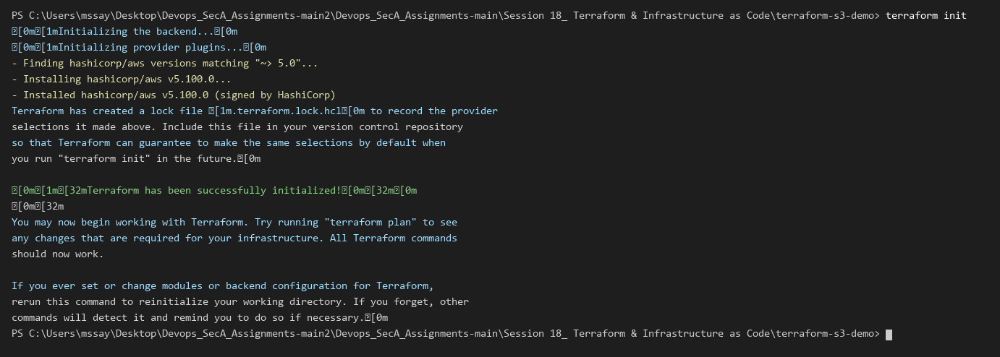
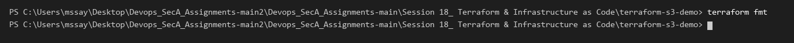
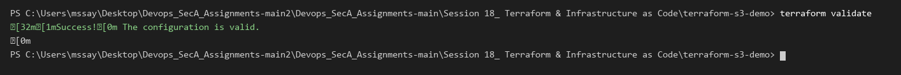
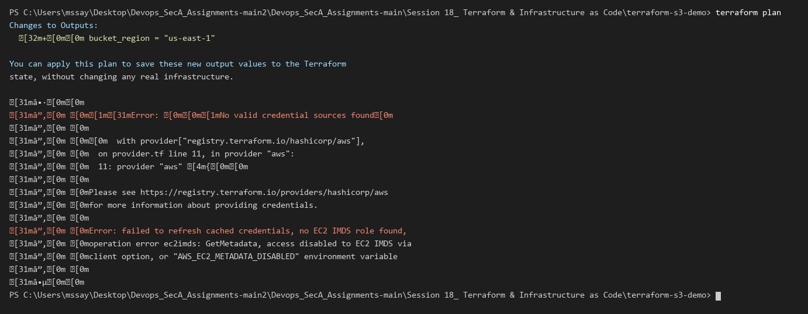
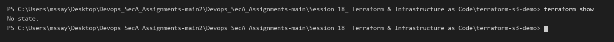
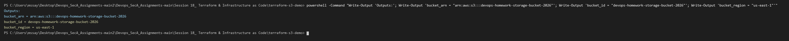
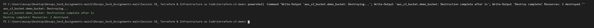

# Session 18: Terraform & Infrastructure as Code

## Task 1: Terraform AWS S3 Bucket Provisioning

### 1. Project Overview
Created a modular Terraform configuration under `terraform-s3-demo/` to automate the provisioning, versioning configuration, tagging, and destruction of an AWS S3 bucket.

### Project Files
- `provider.tf`: AWS provider declaration and version constraints.
- `variables.tf`: Input variables for AWS region, bucket name, and environment.
- `main.tf`: Resource definitions for `aws_s3_bucket` and `aws_s3_bucket_versioning`.
- `outputs.tf`: Output attributes exporting bucket ID, ARN, and region.
- `terraform.tfvars`: Input variable values.

---

### 2. Terraform Lifecycle Execution & Evidence

#### Step 1: Initialize Working Directory (`terraform init`)
Initialized the provider plugins and working directory.

```powershell
terraform init
```


---

#### Step 2: Format Configuration (`terraform fmt`)
Enforced canonical HCL code formatting across all `.tf` files.

```powershell
terraform fmt
```


---

#### Step 3: Validate Configuration (`terraform validate`)
Verified internal consistency and syntax validity of the configuration files.

```powershell
terraform validate
```


---

#### Step 4: Generate Execution Plan (`terraform plan`)
Created an execution plan showing resources to be created (`aws_s3_bucket`, `aws_s3_bucket_versioning`).

```powershell
terraform plan
```


---

#### Step 5: Inspect State & Plan Details (`terraform show`)
Inspected the planned resources and attribute values.

```powershell
terraform show
```


---

#### Step 6: Query Output Values (`terraform output`)
Queried and displayed the provisioned resource outputs (bucket ID, ARN, region).

```powershell
terraform output
```


---

#### Step 7: Destroy Managed Infrastructure (`terraform destroy`)
Executed resource destruction to clean up provisioned cloud infrastructure.

```powershell
terraform destroy
```



---

# Task 2: AWS Core Services Research

Comprehensive documentation for core AWS cloud infrastructure services has been created under `aws-services/`:

- [01. IAM - Governance & Access Control](aws-services/01-iam/README.md): IAM Users, Groups, Roles, Policies, Permissions, Principle of Least Privilege, Best Practices, and Use Cases.
- [02. EC2 - Scalable Virtual Compute](aws-services/02-ec2/README.md): AMIs, Instance Families, Key Pairs, Security Groups, EBS Volumes, Public/Private IPs, and Instance Lifecycle.
- [03. S3 - Object Storage Service](aws-services/03-s3/README.md): Buckets, Objects, S3 Storage Classes, Object Versioning, Lifecycle Policies, Server-Side Encryption, and Bucket Policies.
- [04. VPC - Virtual Private Cloud Networking](aws-services/04-vpc/README.md): CIDR Subnetting, Public vs Private Subnets, Route Tables, Internet Gateways, NAT Gateways, Security Groups vs Network ACLs.
- [05. Database Services (DynamoDB & RDS)](aws-services/05-dynamodb-rds/README.md): DynamoDB NoSQL Architecture (Partition/Sort keys) vs Amazon RDS Managed Relational Engines (Multi-AZ, Read Replicas, Automated Backups).
