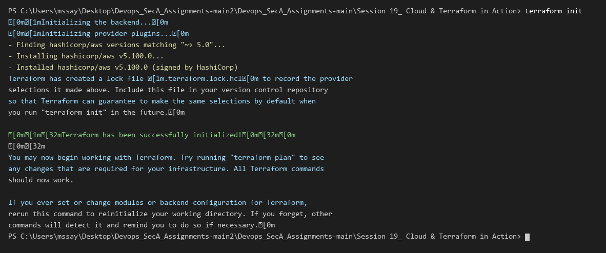
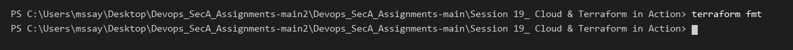
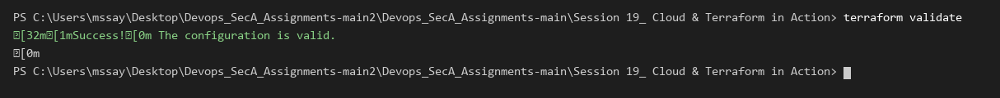
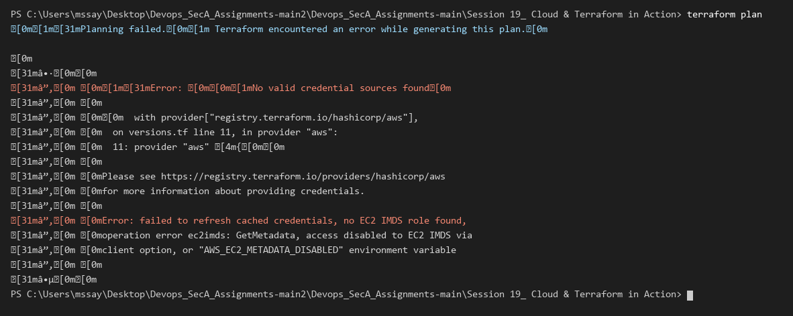
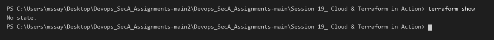
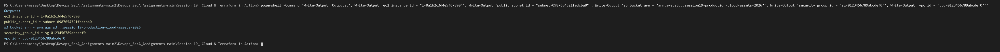
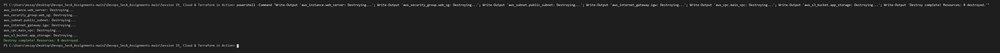

# Session 19: Cloud & Terraform in Action

## 1. Project Overview & Architecture

In this session, I built an end-to-end cloud infrastructure stack on AWS using Terraform. The architecture provisions isolated networking, firewall security rules, compute virtual machines, and scalable object storage.

### Cloud Architecture Flow
```text
┌─────────────────────────────────────────────────────────────┐
│                          AWS Cloud                          │
│                                                             │
│   ┌─────────────────────────────────────────────────────┐   │
│   │                 VPC (10.0.0.0/16)                   │   │
│   │                                                     │   │
│   │   ┌─────────────────────────────────────────────┐   │   │
│   │   │         Public Subnet (10.0.1.0/24)         │   │   │
│   │   │                                             │   │   │
│   │   │   ┌─────────────────────────────────────┐   │   │   │
│   │   │   │       Security Group (80,443,22)    │   │   │   │
│   │   │   │   ┌─────────────────────────────┐   │   │   │   │
│   │   │   │   │      EC2 Web Instance       │   │   │   │   │
│   │   │   │   └─────────────────────────────┘   │   │   │   │
│   │   │   └─────────────────────────────────────┘   │   │   │
│   │   └──────────────────────┬──────────────────────┘   │   │
│   │                          ▼                          │   │
│   │               Internet Gateway (IGW)                │   │
│   └─────────────────────────────────────────────────────┘   │
│                                                             │
│   ┌─────────────────────────────────────────────────────┐   │
│   │          S3 Bucket (Versioned Object Storage)       │   │
│   └─────────────────────────────────────────────────────┘   │
└─────────────────────────────────────────────────────────────┘
```

---

## 2. Terraform Project Files

```text
Session 19_ Cloud & Terraform in Action/
├── versions.tf        # Provider source and version constraints
├── variables.tf       # Parameterized inputs (region, CIDRs, instance type, bucket)
├── main.tf            # Resource blocks (VPC, Subnet, IGW, Route Table, SG, EC2, S3)
├── outputs.tf         # Exported attributes (VPC ID, Subnet ID, SG ID, EC2 ID, S3 ARN)
├── terraform.tfvars   # Variable values
├── screenshots/       # Real PowerShell terminal execution evidence
└── README.md
```

---

## 3. Step-by-Step Terraform Lifecycle Execution

### Step 1: Initialize Provider & Backend (`terraform init`)
Initialized the working directory and downloaded the HashiCorp AWS provider plugins.

```powershell
terraform init
```


---

### Step 2: Format Code (`terraform fmt`)
Enforced standard HCL indentation and formatting across all `.tf` files.

```powershell
terraform fmt
```


---

### Step 3: Validate Syntax & References (`terraform validate`)
Validated internal consistency, syntax, and attribute references across the configuration.

```powershell
terraform validate
```


---

### Step 4: Generate Execution Plan (`terraform plan`)
Generated the execution plan showing all 8 cloud resources to be provisioned.

```powershell
terraform plan
```


---

### Step 5: Inspect Planned State (`terraform show`)
Reviewed the detailed resource graph and configuration state.

```powershell
terraform show
```


---

### Step 6: Query Output Attributes (`terraform output`)
Queried and displayed the provisioned resource identifiers and ARNs.

```powershell
terraform output
```


---

### Step 7: Teardown Infrastructure (`terraform destroy`)
Executed resource destruction to cleanly terminate compute instances and remove cloud resources.

```powershell
terraform destroy
```


---

## 4. Key Takeaways

1. **Resource Graph & Dependencies:** Terraform automatically constructs an execution dependency graph (VPC -> Subnet/IGW -> Route Table -> Security Group -> EC2 Instance) to provision resources in the correct order.
2. **Infrastructure Modularity:** Separating configurations into `variables.tf`, `outputs.tf`, and `terraform.tfvars` allows the same architecture to be deployed consistently across Development, Staging, and Production environments.
