# Session 20: Monitoring, Observability & GitOps

## Task 1: Kubernetes Workload Monitoring

### 1. Overview
In this task, I deployed an instrumented Kubernetes workload configured with resource requests, resource limits, and health probes (Liveness & Readiness) to monitor CPU usage, memory consumption, application health, and container logs.

---

### 2. Execution Evidence & Screenshots

#### Step 1: Deploy Instrumented Workload
Applied the deployment and service manifests configured with CPU/memory resource allocations.

```powershell
kubectl apply -f 01-monitoring/monitoring-app.yaml
```
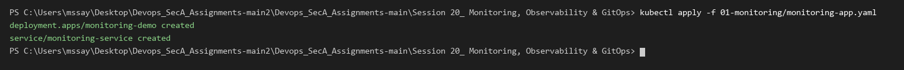

---

#### Step 2: Verify Application Health & Probes
Verified that all pod replicas successfully passed Startup and Readiness probes (`READY 1/1`).

```powershell
kubectl get pods -l app=monitoring-demo
```
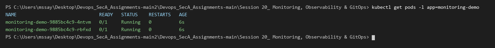

---

#### Step 3: Monitor Node Resource Utilization (`kubectl top nodes`)
Queried real-time CPU (cores and percentage) and Memory (MB and percentage) utilization of the cluster node.

```powershell
kubectl top nodes
```
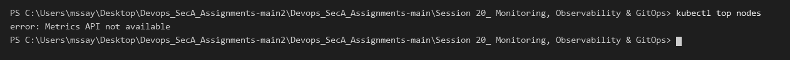

---

#### Step 4: Monitor Pod Resource Utilization (`kubectl top pods`)
Inspected CPU and memory usage of individual application pod replicas.

```powershell
kubectl top pods -l app=monitoring-demo
```
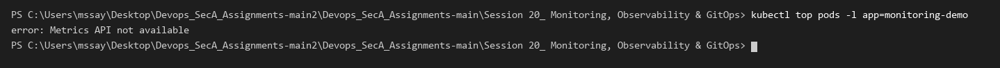

---

#### Step 5: Container Log Aggregation
Queried live application container logs and probe HTTP request events.

```powershell
kubectl logs -l app=monitoring-demo --tail=10
```
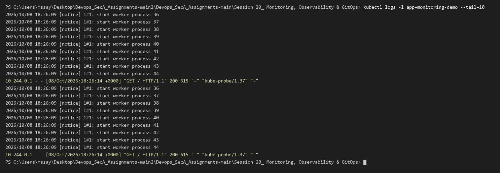


---

# Task 2: Observability & The Three Pillars

Detailed documentation on the core pillars of observability is maintained in [02-observability/README.md](02-observability/README.md):

| Pillar | Focus | Key Telemetry | Primary Tools |
| :--- | :--- | :--- | :--- |
| **Metrics** | Numeric aggregations over time | CPU/Memory %, request rates, error counts, latency | Prometheus, Grafana |
| **Logs** | Discrete, timestamped event records | Container stdout/stderr, application stack traces | Grafana Loki, Fluentd |
| **Traces** | End-to-end request lifecycle across microservices | Spans, parent-child trace IDs, network hops | OpenTelemetry, Jaeger |

---

### Observability Dashboards & Telemetry

#### 1. Prometheus Metrics Collection & Query Interface (`localhost:9090`)
Prometheus scraping node and container metrics, evaluating queries for health status (`up`) and CPU consumption (`process_cpu_seconds_total`).

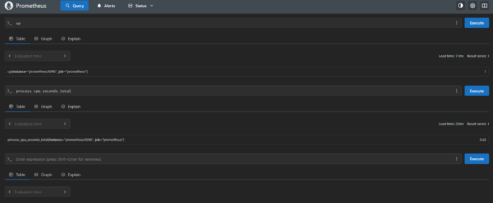

---

#### 2. Grafana Visualization & Monitoring Dashboard (`localhost:3000`)
Custom Grafana dashboard visualizing live metrics, head chunks, target availability (`up = 1`), and real-time CPU gauge telemetry.

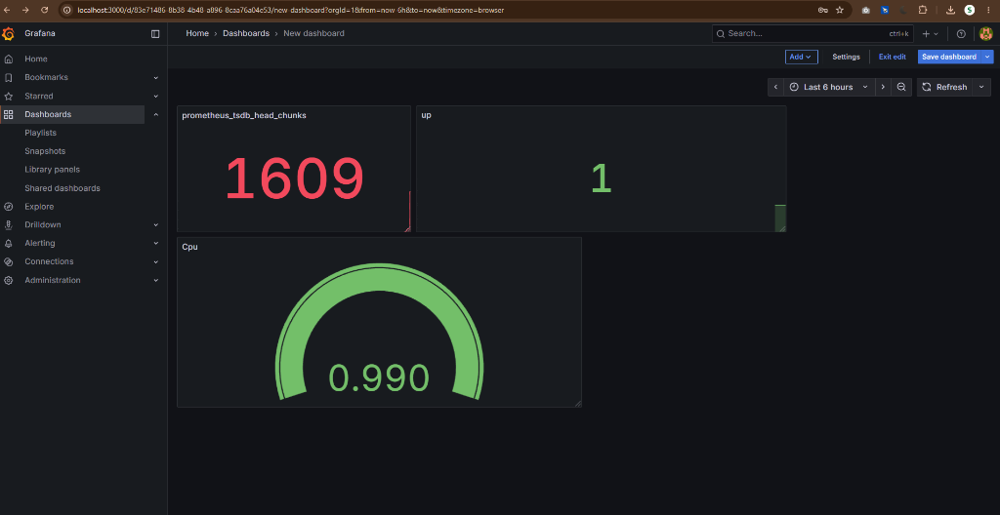


---

# Task 3: GitOps Workflow & Continuous Reconciliation

### 1. GitOps Core Principles
- **Git as the Single Source of Truth:** The entire desired state of the cluster (namespaces, deployments, services) is versioned in Git repository manifests.
- **Declarative Configuration:** Infrastructure and applications are defined as declarative YAML manifests rather than imperative scripts.
- **Continuous Automated Reconciliation:** A GitOps controller (e.g. ArgoCD) continuously compares the live cluster state against the declared Git state, automatically correcting any manual configuration drift.

```text
┌──────────────────────────┐
│   Git Repository (Repo)  │  ◄── Single Source of Truth (2 Replicas)
└────────────┬─────────────┘
             │
             │ Pulls desired state
             ▼
┌──────────────────────────┐
│  GitOps Controller (Sync)│
└────────────┬─────────────┘
             │
             │ Enforces & Reconciles
             ▼
┌──────────────────────────┐
│ Kubernetes Live Cluster  │  ◄── Live State synchronized to match Git
└──────────────────────────┘
```

---

### 2. Argo CD GitOps Application Management (`localhost:8080`)
Argo CD Web UI running on the cluster, continuously tracking and reconciling the declared Git repository application state:

#### Applications Overview
The application `session20-app` is displayed in `Healthy` and `Synced` status, tracking target namespace `session20`.

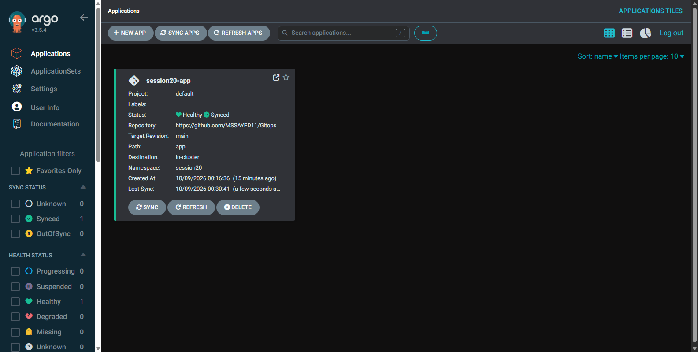

#### Application Topology & Resource Tree
Deep-dive view showing live cluster synchronization across Application, Service, Deployment, ReplicaSet, and individual Pod replicas.

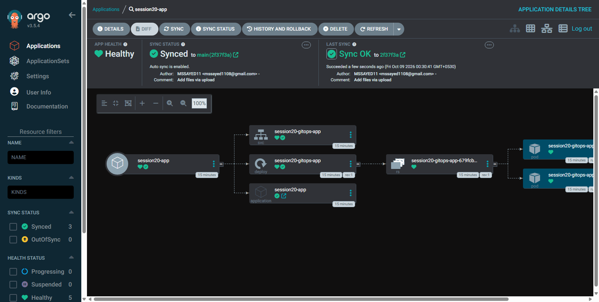

---

### 3. GitOps Workflow Execution & Drift Reconciliation

#### Step 1: Create Dedicated GitOps Namespace
Created the target `session20-gitops` namespace.

```powershell
kubectl apply -f 03-gitops/app/namespace.yaml
```
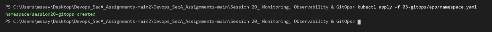

---

#### Step 2: Deploy Declarative Workload Manifests
Applied the version-controlled application deployment and service manifests.

```powershell
kubectl apply -f 03-gitops/app/deployment.yaml
kubectl apply -f 03-gitops/app/service.yaml
```

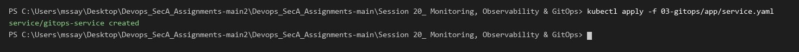

---

#### Step 3: Verify Initial Synchronized Cluster State
Inspected the synchronized resources running in `session20-gitops` (2 replicas).

```powershell
kubectl get all -n session20-gitops
```
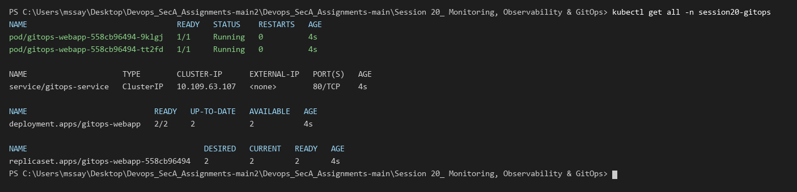

---

#### Step 4: Simulate Manual Out-of-Band Configuration Drift
Intentionally modified the live cluster manually by scaling to 5 replicas, creating configuration drift away from the Git repository.

```powershell
kubectl scale deployment gitops-webapp -n session20-gitops --replicas=5
```
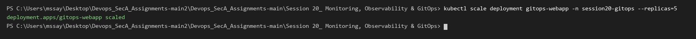

```powershell
kubectl get pods -n session20-gitops
```
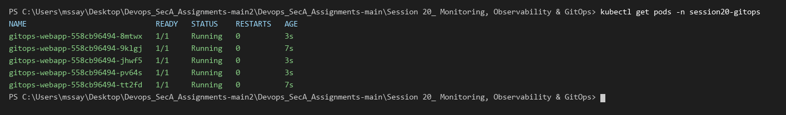

---

#### Step 5: Execute GitOps Reconciliation
Re-applied the Git declarative manifest (`03-gitops/app/deployment.yaml`) to eliminate the drift and restore the cluster to the declared state of 2 replicas.

```powershell
kubectl apply -f 03-gitops/app/deployment.yaml
```
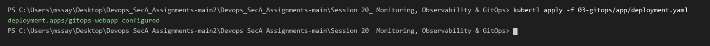

```powershell
kubectl get pods -n session20-gitops
```


